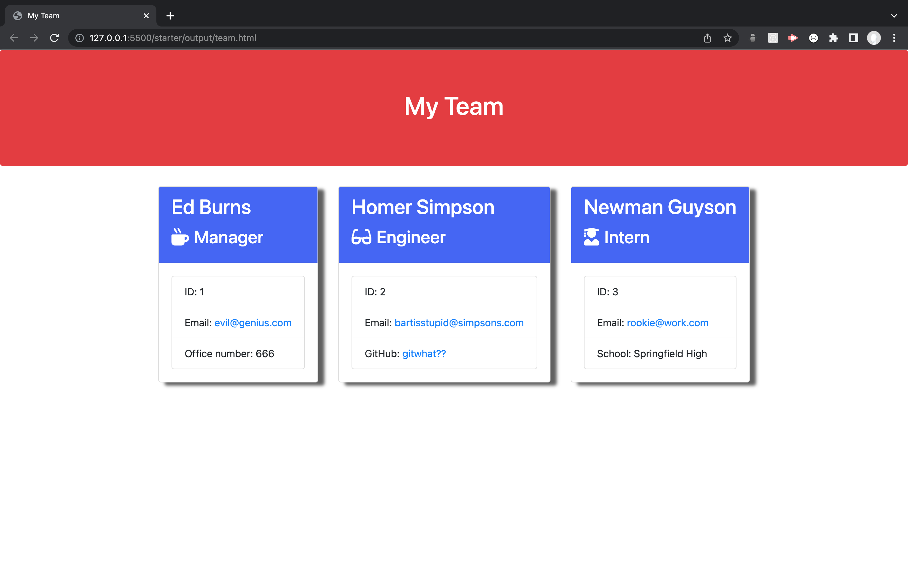

# Title

## Screenshot

## Description

A Node.js application that generates a webpage that displays a team's basic info so that a user have quick access to their emails and GitHub profiles.

## Table of Contents

- [title](#title)
- [screenshot](#screenshot)
- [description](#description)
- [installation](#installation)
- [usage](#usage)
- [tests](#tests)
- [license](#license)
- [authors](#authors)
- [questions](#questions)

## Installation

npm node

## Usage

From the command line and from the root file call node index.js and a number of prompts will collect information about
each team member

## Tests

From the root folder call npm run test.
This uses jest to run our tests

## License

MIT

## Authors

Dan Trovato

## Questions

dantrovato@gmail.com

https://github.com/dantrovato
